# Архитектура

## Рамка решения

Средний поток — `200 000 / 86 400 ≈ 2,3` тикета/с, пик — `10–20 тыс. / 10 мин ≈ 16,7–33,3` тикета/с. Это не hyperscale-задача; сложность создают 14-кратный burst, дубли одного инцидента, 15-минутный SLA и цена небезопасного ответа. Target проектируется на `100 events/s` с запасом, но масштабируется по возрасту очереди и SLA, а не только по CPU.

Граница fast route: от получения события routing-worker из broker до атомарно сохранённого маршрута — p95 `<500 ms`. Intake отдельно подтверждает канал после durable ingress commit, ориентир p95 `<100 ms`; publish в broker делает outbox relay. Retrieval, генерация и доставка не входят в fast-route SLO и работают асинхронно.

[Mermaid-исходник диаграммы](diagrams/system.mmd)

## Поток данных и состояния

1. Адаптер валидирует контракт, строит ключ `(channel, source_event_id)`, а локальный PII tokenizer — redacted-текст и typed findings (`card_number`, `credential`, `one_time_code`, passport/SNILS). Одна ingress-транзакция сохраняет encrypted raw в restricted partition, redacted canonical event, keyed fingerprint и ingest outbox; канал ACK получает только после commit. Так raw-store и broker не образуют unsafe dual-write. Повтор ключа возвращает прежний результат, другой fingerprint означает collision и quarantine.
2. Outbox relay публикует событие в durable broker, который буферизует burst. Idempotent worker сначала применяет multidimensional hard-risk/PII rules. Payment/security/privacy/self-harm получают детерминированную priority queue и durable early exit без classifier/retrieval. Для low-risk локальный intent classifier возвращает score/margin, а full-request scope gate блокирует multi-intent и необъяснённый остаток текста.
3. Capability policy различает `human_only`, `operator_suggest`, `auto_template`. Первая Postgres-транзакция фиксирует route, `candidate_action`, состояние `automation_candidate_pending`, audit transition и outbox; для human-only она сразу фиксирует effective human route. До commit нет ни ответа, ни ACK исходного broker-message. Effective user-action для auto/suggest ещё не существует.
4. Slow path проверяет confirmed-incident cache и выполняет global KB retrieval, затем отдельные approved/current/expiry/allowlist gates: classifier intent должен совпасть с intent top-article, disagreement не усредняется. Auto-path напрямую рендерит exact template без LLM; composer работает только для operator-suggest. Final transaction атомарно фиксирует effective action (`routed_human`, `suggestion_created` или `reply_authorized`), article/template hash, короткий authorization lease, audit и branch outbox. Suggestion-outbox питает inbox оператора; только reply-authorized идёт dispatcher. Перед user-send dispatcher проверяет kill switch/revocation/lease, но не пересчитывает смысл ответа; `delivery_id` стабилен.
5. Operator approve/edit/reject возвращается как versioned event в final transaction/outbox; human reply или approved draft отправляет тот же idempotent dispatcher. Reopen, CSAT и SLA затем попадают в warehouse и связываются с версиями модели, policy, KB и generator.

Четыре разные сущности не смешиваются: `candidate_action → effective_action → delivery_state → resolution_outcome`. Production state machine: `accepted → routed_human | automation_candidate_pending → suggestion_created → operator_approved → reply_authorized` либо direct `automation_candidate_pending → reply_authorized`; далее `send_pending → sent | failed → resolved | reopened`. PoC синхронно рассчитывает policy и заканчивается на `send_pending`/`unknown`; retry имеет ключ `event_id + stage + version` и не пересчитывает уже авторизованный текст.

Event/API contracts имеют явную версию, consumers поддерживают `N` и `N−1`. DB меняется по expand/contract: additive schema + dual-read/write, backfill, переключение feature flag, затем удаление старого поля только после обновления consumers. Старые schema/model/policy/KB artifacts сохраняются на время rollback.

## Компоненты и хранилища

| Компонент | Ответственность и выбор |
|---|---|
| Adapters + ingress outbox + broker | Единый versioned event contract; одна ingress-транзакция устраняет raw/event dual-write, relay даёт at-least-once delivery. Broker нужен для burst/backpressure; exactly-once не обещается. |
| Risk + intent workers | Stateless cascade: risk-first early exit, затем дешёвый ML + OOD/multi-intent/scope. Risk taxonomy, а не ML-topic, выбирает safety/security/privacy/payment queue. |
| Postgres + outbox | Restricted ingress schema хранит encrypted raw/TTL отдельно от operational decision tables; decision DB — источник истины для transitions/idempotency/delivery. Audit реплицируется из outbox в WORM без dual-write. |
| Human/generation queues | Payment/security/legal выше обычных тикетов; generation shed первой. Autoscale по oldest-message age и прогнозу SLA. |
| KB/retrieval | Target contract: `status`, `intent`, locale/product, owner, `valid_until`, `auto_reply_allowed`. PoC строит один immutable global TF-IDF index и применяет approval/current gates после ranking; target добавляет metadata filter + BM25/dense + rerank/cache. Consensus с classifier обязателен. |
| Composer + output policy | Auto MVP обходит generator и берёт static approved template по version/hash. Mock/private LLM допустим только для operator-suggest; bounded redacted context, без tools. |
| Dispatcher | Идемпотентная отправка в CRM/канал, exponential backoff+jitter, retry budget и DLQ. Он читает outbox и не принимает semantic-решений. |
| Control plane | Подписанные model/policy/KB artifacts, staged rollout, allowlist категории, category/global kill switch, rollback без deploy. |

## Инварианты безопасности

- `high_risk OR human_only OR unknown OR mixed/unsupported scope ⇒ action != auto_reply`.
- `auto_reply` возможен только при class top-1/margin, OOD, full-request scope, global retrieval consensus, KB status/expiry/allowlist/intent, output и durable-audit gates; generator для него не вызывается.
- Raw PII не попадает в classifier/retrieval/generator logs и метрики; LLM видит только bounded redacted context. Email/phone маскируются, а card/credential/one-time-code/passport/SNILS/payment запрещают auto-path.
- Нет user-visible send до commit `decision + audit + outbox`; при недоступной БД событие не ACK, повторяется, затем DLQ+alert. Нельзя притвориться, что оно «передано человеку» без durable записи.
- User/KB text считается недоверенными данными. Prompt не может изменить policy; generator не имеет credentials, tools или права выбрать действие.

## Надёжность и деградации

| Сбой | Поведение |
|---|---|
| LLM/composer timeout | Auto-template lane не зависит от LLM. Operator-suggest получает точный approved fragment, остающийся невидимым пользователю до решения оператора; иначе human. |
| Retrieval/KB unavailable | Cached signed index/result допустим только с теми же consensus/status/expiry/allowlist gates; cache miss → human, не свободная генерация. |
| DB/audit unavailable | Не отправлять и не ACK; bounded retry → DLQ + page. Availability уступает auditability. |
| Burst/incident | Priority queues, autoscale по queue age; отключить suggest/generation первой. Redacted dedup создаёт лишь `incident_candidate`; incident manager подтверждает. |
| Poison message/provider outage | Schema quarantine либо bounded retry/backoff; DLQ имеет replay tooling и сохраняет idempotency key. |

Delivery — at-least-once с idempotent consumer/dispatcher. Два конкурентных worker могут повторить дешёвое вычисление до commit, но только одна транзакция создаёт decision/outbox; production reservation/state-stage keys дополнительно убирают повтор дорогой генерации.

## PoC и путь эволюции

PoC — modular monolith: typed PII/redaction, multidimensional risk+bounded full-request grammar, calibrated TF-IDF+LogReg, immutable global retrieval, three-lane policy, exact renderer, operator-only mock composer, SQLite transaction, CLI, mutation/golden evaluation и fault tests. Auto включён только для language FAQ; auth intents остаются suggest-only. PoC реально доказывает early exit, abstain/consensus, candidate→effective downgrade, idempotency и audit-before-outbox; не реализует API, broker, dispatcher, RBAC/encryption, WORM или distributed concurrency.

Выбор осознанный: Kafka/FastAPI/vector DB/Kubernetes не улучшают доказательство при `33 events/s`. Следующий шаг — adapters + managed broker + Postgres/outbox и shadow integration с CRM; затем suggest; лишь после pilot safety gates — узкий exact-template auto-path. Смена TF-IDF на embeddings/LLM не меняет contracts и deterministic authorization policy.
